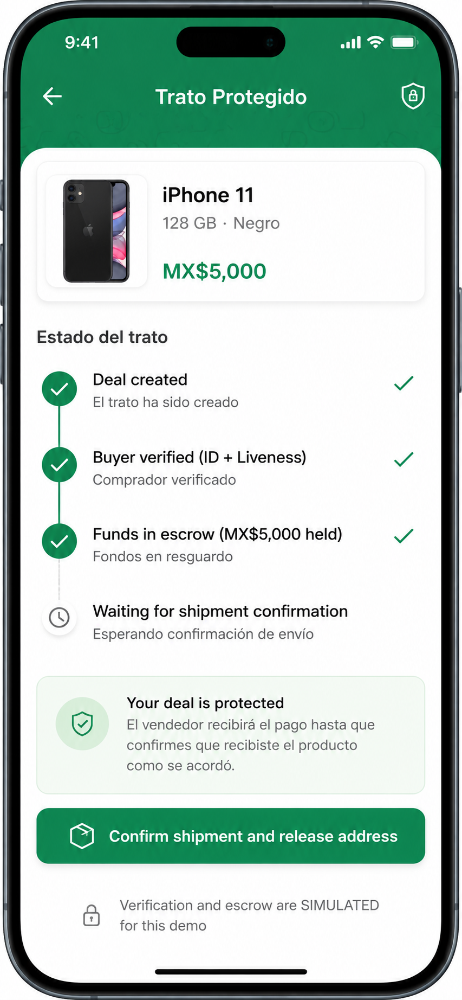

# PACKET — Week 3 Build Slice
**Role: Money · Vacuum: Proof-of-Human for Commerce (honoring Blueprint Condition #4)**

## 1. Problem (in my own words)

On WhatsApp Marketplace, a seller and a buyer close deals for used items (e.g. phones) with zero verification layer. The buyer may be a fake profile or a real-but-scamming counterpart (fake-overpayment script). Today, if something goes wrong, the seller recovers about 10 centavos per peso claimed (Condusef), and 93% of cases never enter the justice system. The platform (WhatsApp/Meta) takes no responsibility — the deal happens outside any verified rail.

## 2. Exact user

An individual seller in Mexico City selling a used phone (ticket ~MX$5,000) on WhatsApp Marketplace. Not a formal business — no margin to absorb a loss, no access to lawyers.

## 3. Success definition

**Before the module closes:** a seller can create a deal, a buyer can pass a simulated identity check (ID + liveness) locked to THAT specific deal, funds are held in simulated escrow, and the seller can release shipment only after seeing "buyer verified + funds held" on screen.

## 4. Mockup — AI-generated screen

Key screen: "Deal created → Buyer verified → Funds in escrow → Waiting for shipment confirmation."



## 5. Flow — Mermaid Diagram (swimlane: Seller / Buyer / System / AI)

```mermaid
flowchart TD
    subgraph Seller
        V1[Creates the deal: item + price MX$5,000]
        V4[Sees status: Buyer verified + Funds in escrow]
        V5[Confirms shipment]
        V7[Confirms delivery received]
    end

    subgraph Buyer
        C1[Receives deal link]
        C2[Uploads ID photo + liveness selfie]
        C3[Transfers funds to escrow]
        C6[Confirms item received]
    end

    subgraph System
        S1[Generates unique transaction-locked deal]
        S3[Locks funds in simulated escrow]
        S8[Releases funds to seller]
    end

    subgraph AI_Vision_API
        S2[Verifies ID + liveness against the deal]
    end

    V1 --> S1 --> C1 --> C2 --> S2
    S2 -- valid --> C3 --> S3 --> V4 --> V5 --> C6 --> S8
    S2 -- invalid --> C2
